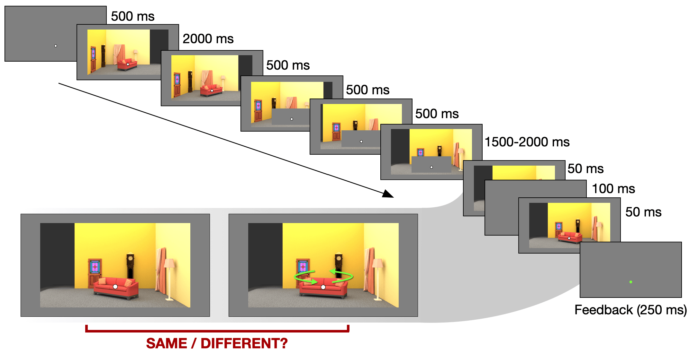

# Experiment running code

To run the experiments in Aldegheri, Gayet & Peelen, "Scene context automatically drives predictions of object transformations" (forthcoming)

<!---->

This code was written using [jsPsych]() version 6.3.0, and:
- [jsPsych-psychophysics](https://jspsychophysics.hes.kyushu-u.ac.jp/) 2.3.1 by [Daiichiro Kuroki](https://github.com/kurokida/);
- [This repo](https://github.com/svanhedger/jspsych/tree/master/scripts/backward-digit-span/) by [Stephen Van Hedger](https://svanhedger.github.io/) for the adaptive staircase code.

This code is ready to be run locally, but it can be adapted to run experiments on platforms such as [Pavlovia](), as well as to interface with participant recruiting platforms such as [Prolific](). 

Experimental stimuli can be downloaded [here](https://osf.io/wnefh/).